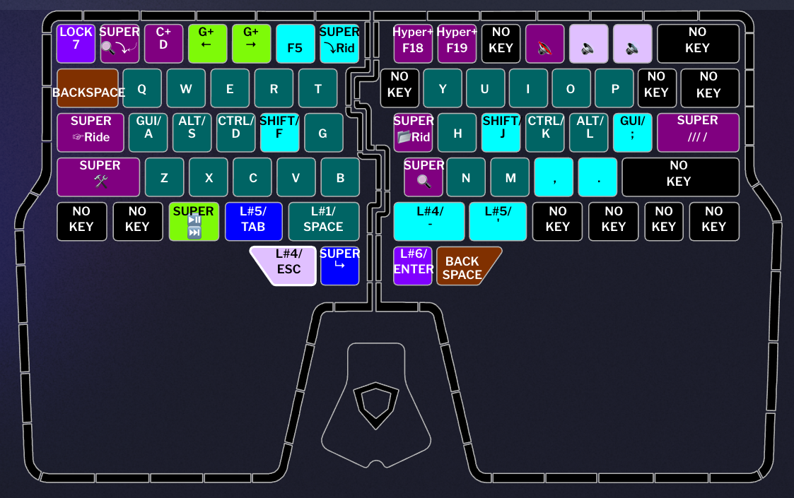

To use this layout, you need to set the default layer to either 9 (OSX) or 10 (Windows).

I mainly use this layout when writing code inside JetBrains Rider. Some shortcuts are custom to me, preventing clashes between applications. 

## Default Layers (Layer 9 / 10)

Home Row Mod is used, allowing to hold:
- F / J for Shift
- D / K for Control
- S / L for Option / Alt
- A / ; for Cmd / Gui

The right part of the keyboard is offset by one key to the right to reduce the pinky traveling space.

Backspace, Tab, Space, Esc and Enter are accessible on the left side allowing fast access when using the mouse with the right hand.

To switch between windows and mac layouts, you need to switch to layer 7, then press one of the bottom right keys while holding the backspace key. This prevent switching OS if not intended.

Holding the space bar will switch to the corresponding CMD layer.
Holding Tab or ' will switch to the NumPad layer.
Holding Esc or - will switch to the Accents layer.
Holding the left Enter will type Alt+Enter.
Holding the right Enter will switch to the F# layer.

## Cmd (Layer 1 / 2)

This is where you can access the arrows and specific commands for the OS. 
- The tab key is assigned to the Language Switch.
- I kept the Mod row on the left part, allowing to do word / line selection when combined with the arrows.
- T is for the Notifications.
- G for the Mission Center.
- B if for the Launch Pad.
- Z X C are for taking screenshots (window, area, custom).
- The key to the left of N is for displaying the hidden files in the Finder.
- Holding V will switch the arrows to the mouse cursor movement.

## Mouse (Layer 3)

This layer override the Cmd layer by replacing the arrows with the mouse movement.
To switch to this layer, you need to press the V key while in the Cmd layer (layer 1 / 2).

## Accents (Layer 4)

I hate dead keys. As you've seen, I'm using the home row mod, and when you try to type fast, special characters always get written when I hold Alt. To prevent this, I deactivated the dead keys in my keyboard layout and use instead the Alt # codes by pressing Alt and the corresponding numpad numbers. I then created macros for each characters. And also created a super key for each of them. Single click is the lower case character. Double click is the capital. I you are on Mac and are using my AltCode layout, I allowed to hold shift to write the uppercase instead of using the double click.

## Numpad (Layer 5)

Until the Dygma Defy is released, I prefer less finger traveling, especially on a staggered keyboard. This is why the numbers are on only two rows and not replicating the default numerical pad.
On the right side, all the numerical special characters.
I also switch the backspace keys to delete.

## Numpad (Layer 5)

Basic F keys with home row mod allowing easy shortcuts.

## Numpad (Layer 5)

I don't really use this layer, but useful when using applications requesting to hold keys that I assigned modifiers, like the home row or the thumb keys.

## Q&A
- `Why the default layer is not 1?`
 Until now, it is impossible to set an OSL (One Shot Layer) to layer 9 or 10. Since OSL is rarely used for the default layer, I don't need to move layers when I reach the limit.
- `The layer 4 doesn't work on my computer.`
 The special characters are bind to a specific keyboard layout. It works by default on windows if the Alt+Num shortcuts works. On Mac, you need to either use the default Unicode Hex Input layout or AltCode, a custom layout I made. This allow me to maintain one single layer without having two layers (one for Mac and the other for Windows).
- `Ctrl and Cmd are inverted on Mac.`
 On Mac, you can specify to invert the those only for the Raise. This prevent layer duplications.
 
